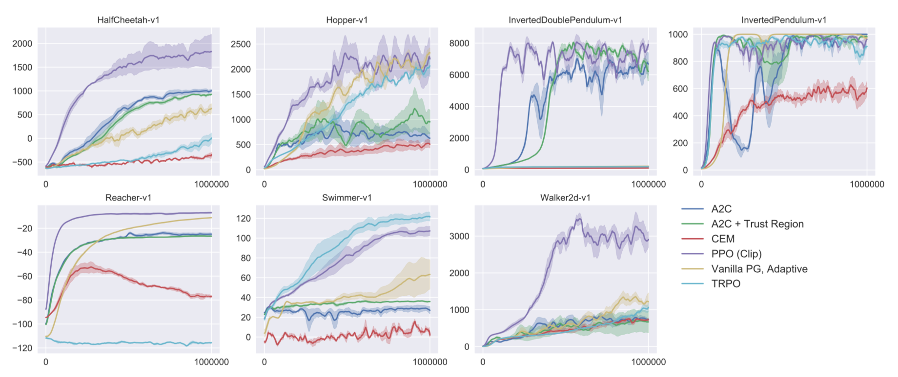

# Reinforcement-Implementation

This project aims to reproduce the results of several model-free RL algorithms in continuous action domain (mujuco environment).

This projects
* uses pytorch package
* implements different algorithms independently in seperate files
* is written in simplest style
* tries to follow the original paper and reproduce their results

My first stage of work is to reproduce this figure in the PPO paper.

- [x] A2C
- [x] ACER (A2C + Trust Region): It seems that this implementation has some problems ... (welcom bug report) 
- [ ] CEM
- [x] TRPO (TRPO single path)
- [x] PPO (PPO clip)
- [x] Vanilla PG

On the next stage, I want to implement

- [ ] DDPG
- [ ] Random Search (see [Simple random search provides a competitive approach to reinforcement learning](https://arxiv.org/pdf/1803.07055.pdf))

Then next stage, discrete action space problem and raw video input (Atari) problems ...

- [ ] DQN and relevant techniques (target network / double Q-learning / prioritized experience replay / dueling network structure)